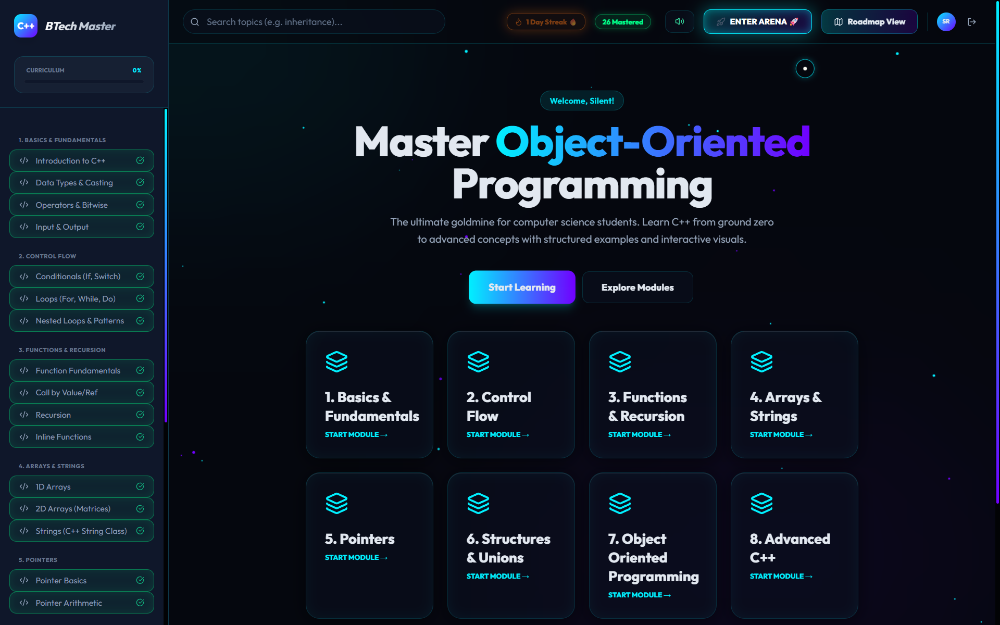
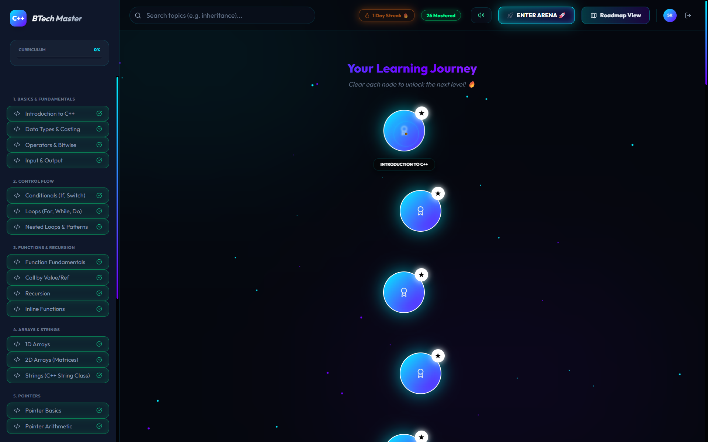
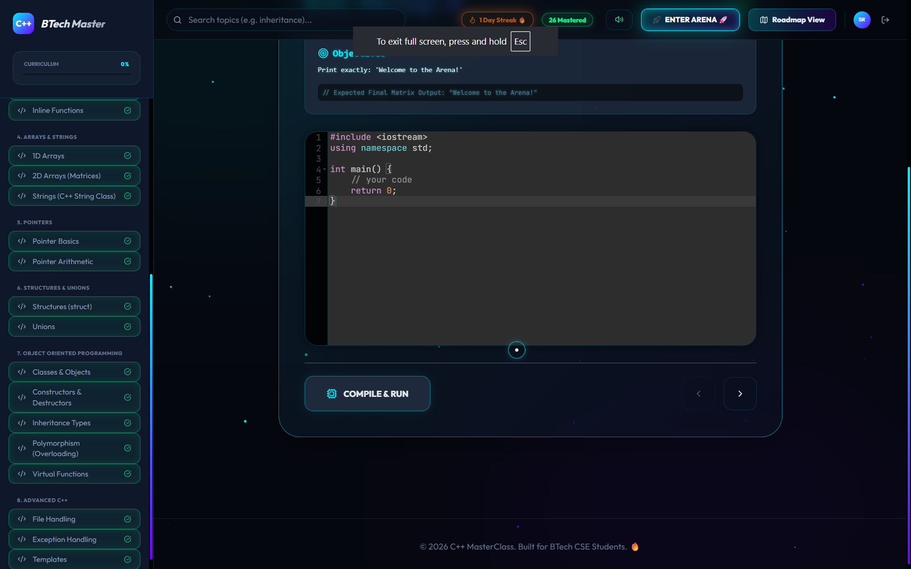

# 🚀 C++ MasterClass – Interactive Learning Platform

A futuristic, interactive, and gamified C++ learning platform designed to make programming **engaging, structured, and hands-on**.

🌐 **Live Demo:**
👉 https://codewitharmaan.netlify.app/

---

## 🎯 Features

### 🧠 Structured Learning

* Step-by-step roadmap (Beginner → Advanced)
* Topic-wise explanations with real-life analogies
* Guided learning instead of random tutorials

---

### 💻 Interactive Practice

* Built-in code editor
* Real-time code validation system
* Concept-based checking (not just syntax)

---

### 📊 Progress Tracking

* Track completed topics
* Gamified progress system
* Streak-based engagement

---

### 🔐 Authentication System

* Google Login via Firebase
* User session persistence
* Personalized experience

---

### 🎮 Practice Arena (Unlock Feature)

* Unlocks at 100% course completion
* 100 practice problems (handcrafted + generated)
* Smooth navigation with futuristic transitions
* Feels like a mini coding platform (LeetCode-style)

---

### 🎨 Modern UI/UX

* Glassmorphism design
* Neon futuristic theme
* Smooth animations & micro-interactions
* Custom cursor & motion effects

---

### 🔊 Immersive Experience

* Interactive sound feedback
* Ambient background audio
* Smooth transitions (glitch + tech style)

---

## ⚙️ Tech Stack

* **Frontend:** HTML, CSS, JavaScript
* **Authentication:** Firebase Auth
* **Database:** Firestore
* **Hosting:** Netlify
* **Code Execution:** Judge0 API

---

## 🧩 How It Works

1. User logs in via Google
2. Follows structured roadmap
3. Writes and validates code
4. Progress is tracked
5. At 100% → Practice Arena unlocks
6. User continues advanced practice

---

## 🚀 Future Improvements

* 🏆 Leaderboard system
* 🤖 AI-based coding assistant
* 📱 Mobile optimization
* 🌍 Multi-language support
* 🎯 Daily challenges

---

## 📸 Screenshots

## 💡 Inspiration

This project focuses on solving a key problem:

> Learning programming should be **interactive and engaging**, not passive.

---

## 🙌 Author

**Mohd Armaan Tak**
BTech Student | Developer

---

## ⭐ Show Your Support

If you like this project, consider giving it a ⭐ on GitHub!

---

## ⚠️ Note

This project is built with a strong focus on UI/UX and learning experience.
Some features are continuously being improved for better performance and scalability.

---

💀 *Not just a project — a product in the making.*
